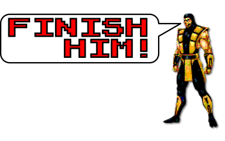

[](http://www.apache.org/licenses/LICENSE-2.0)
[](http://www.oracle.com/technetwork/java/javase/downloads/index.html)
[](http://search.maven.org/#artifactdetails|com.igormaznitsa|mvn-finisher-extension|1.0.0|jar)
[](https://maven.apache.org/)
[](https://www.paypal.com/cgi-bin/webscr?cmd=_s-xclick&hosted_button_id=AHWJHJFBAWGL2)
[](http://yasobe.ru/na/iamoss)



# Changelog

__1.0.1 (31-jan-2020)__
 - added catch of JVM shutdown, its phase __finish-force__
 
__1.0.0 (29-sep-2019)__
 - initial release

# What is it
Small [maven](https://maven.apache.org/) extesion adds three new phases into build process:
 - __finish__ is called in any case if session is started (also called in JVM shutdown)
 - __finish-ok__ is called only if session is built without errors (called in JVM shutdown only if session build completed)
 - __finish-error__ is called only if session is built with errors (called in JVM shutdown only if session buuld completed)
 - __finish-force__ is called only if JVM shutdown (press CTRL+C for instance)
 
 It's behavior very similar to well-known `try...catch...finally` mechanism where __finish-error__ situated in the `catch` section and __finish__ situated in the `finally` section, __finish-ok__ will be called as the last ones in the body.

# How to use?
 Just add extension into project build extension section
```xml
<build>
    <extensions>
        <extension>
            <groupId>com.igormaznitsa</groupId>
                <artifactId>mvn-finisher-extension</artifactId>
                <version>1.0.1</version>
        </extension>
    </extensions>
</build>
```
after every end of session build, the extenstion looks for for finishing tasks in all session projects, for instance task to print some message into console:
```xml
<plugin>
    <groupId>com.github.ekryd.echo-maven-plugin</groupId>
    <artifactId>echo-maven-plugin</artifactId>
    <version>1.2.0</version>
    <executions>
        <execution>
            <id>print-echo</id>
            <phase>finish</phase>
            <goals>
                <goal>echo</goal>
            </goals>
            <configuration>
                <message>Hello World from finishing task</message>
            </configuration>
        </execution>
    </executions>
</plugin>
```
in the case, after session processing end (either successful or error) the task `print-echo` is executed.

If defined several finishing tasks then they will be sorted in such manner:
- list of projects in order provided in maven session project list
- only projects with provided build status will be processed 
- if any error in session build then execution order is:
  - __finish-error__
  - __finish__
- if session build is ok then execution order is:
  - __finish-ok__
  - __finish__
  
__Each detected task is called separately in its own maven request so that all them will be executed even if some of them can be error.__

Work of the extension can be disabled through `mvn.finisher.skip` parameter which can be provided globaly through `-Dmvn.finisher.skip=true` else locally on level of each project through its local project properties.

# Example
Below you can see some example of extension use. The example starts some docker image and then stop and remove it in finishing tasks.
```xml
<?xml version="1.0" encoding="UTF-8"?>
<project xmlns:xsi="http://www.w3.org/2001/XMLSchema-instance" xmlns="http://maven.apache.org/POM/4.0.0"
         xsi:schemaLocation="http://maven.apache.org/POM/4.0.0 http://maven.apache.org/xsd/maven-4.0.0.xsd">
    <modelVersion>4.0.0</modelVersion>

    <groupId>com.igormaznitsa</groupId>
    <artifactId>mvn-finisher-test-docker</artifactId>
    <version>0.0.0-SNAPSHOT</version>

    <packaging>jar</packaging>

    <build>
        <extensions>
            <extension>
                <groupId>com.igormaznitsa</groupId>
                <artifactId>mvn-finisher-extension</artifactId>
                <version>1.0.1</version>
            </extension>
        </extensions>
        <plugins>
            <plugin>
                <groupId>io.fabric8</groupId>
                <artifactId>docker-maven-plugin</artifactId>
                <version>0.31.0</version>
                <executions>
                    <execution>
                        <id>start-docker-container</id>
                        <phase>validate</phase>
                        <goals>
                            <goal>start</goal>
                        </goals>
                        <configuration>
                            <containerNamePattern>test-container-finisher</containerNamePattern>
                            <showLogs>true</showLogs>
                            <images>
                                <image>
                                    <name>docker.bintray.io/jfrog/artifactory-oss:latest</name>
                                    <run>
                                        <wait>
                                            <time>60000</time>
                                            <log>#+\s*Artifactory successfully started \([0-9.]+ seconds\)\s*#+</log>
                                        </wait>
                                    </run>
                                </image>
                            </images>
                        </configuration>
                    </execution>
                    <execution>
                        <id>stop-docker-container</id>
                        <phase>finish</phase>
                        <goals>
                            <goal>stop</goal>
                        </goals>
                        <configuration>
                            <stopNamePattern>test-container-finisher</stopNamePattern>
                            <allContainers>true</allContainers>
                            <removeVolumes>true</removeVolumes>
                        </configuration>
                    </execution>
                    <execution>
                        <id>remove-docker-container</id>
                        <phase>finish</phase>
                        <goals>
                            <goal>remove</goal>
                        </goals>
                        <configuration>
                            <removeMode>run</removeMode>
                            <removeNamePattern>test-container-finisher</removeNamePattern>
                        </configuration>
                    </execution>
                </executions>
            </plugin>
        </plugins>
    </build>

</project>

```